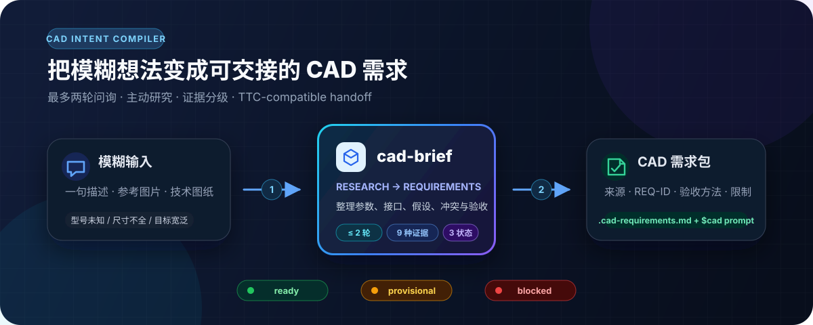
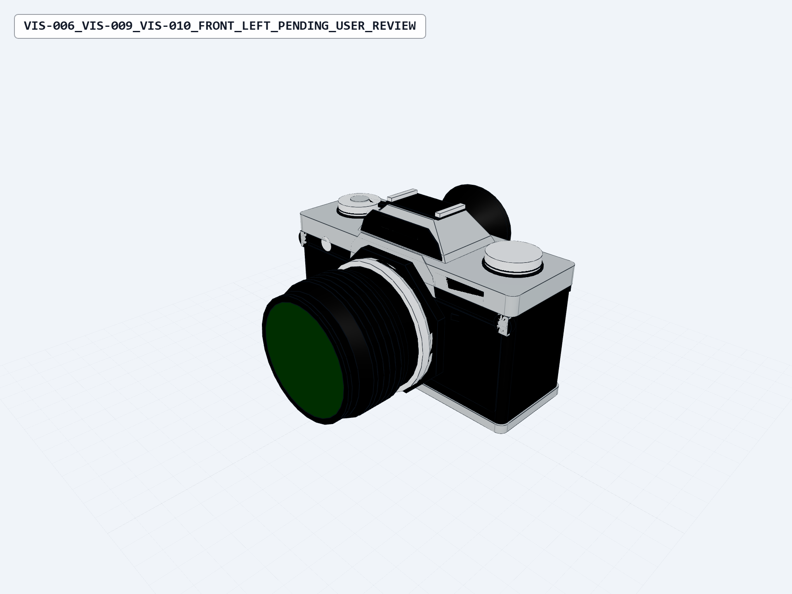
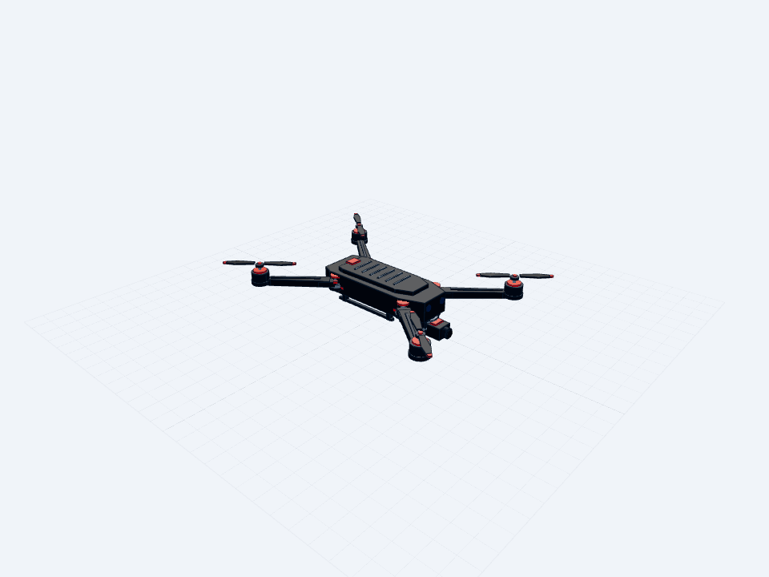

<h1 align="center">
  
  <br>
  cad-brief
</h1>

<p align="center">
  <strong>先把“要建什么”整理成有证据、可验收的 CAD 需求，再交给 Text-to-CAD 建模。</strong>
  <br>
  给只有一句想法、几张参考图或不完整产品信息的新手使用的独立 Codex Skill。
</p>

<p align="center">
  <a href="#quick-start"></a>
  <a href="#workflow"></a>
  <a href="#safety"></a>
</p>

<p align="center">
  <a href="https://github.com/icejyzy0430/cad-brief/actions/workflows/test.yml"></a>
  
  
  
  <a href="LICENSE"></a>
</p>

<p align="center">
  <sub>独立社区项目，与 <a href="https://github.com/earthtojake/text-to-cad">earthtojake/text-to-cad</a> 没有隶属、合作或官方认可关系。</sub>
</p>

<p align="center">
  
</p>

### 30 秒安装（Windows PowerShell）

```powershell
git clone https://github.com/icejyzy0430/cad-brief.git
Copy-Item -Recurse .\cad-brief\cad-brief "$HOME\.codex\skills\cad-brief"
```

<br>

---

<a id="workflow"></a>

## 🧭 先补齐需求，再生成几何

[`earthtojake/text-to-cad`](https://github.com/earthtojake/text-to-cad) 的 `$cad`
负责 build123d、STEP、几何检查、快照和修复；`cad-brief` 只负责建模前的需求准备。

| | 直接调用 `$cad` | 先 `$cad-brief`，再 `$cad` |
| --- | --- | --- |
| 适合输入 | 已经清楚的 CAD 规格 | 模糊描述、参考图、未知型号或缺失尺寸 |
| 问询方式 | 缺少关键条件时进行聚焦澄清 | 最多两轮；第一轮后先研究，第二轮只让用户做关键选择 |
| 未知信息 | 建模时显式假设并报告 | 先按 9 种证据状态整理，再判定 readiness |
| 中间产物 | CAD brief 与参数化源码 | 可审阅、可校验的 `.cad-requirements.md` |
| 最终职责 | 生成并验证 CAD | 需求交接后仍由 `$cad` 生成并验证 CAD |

如果你已有完整的尺寸、接口和验收条件，可以直接使用 `$cad`。`cad-brief` 的价值
在于资料不完整时，先确定“究竟应该建什么”，避免精确验证一份遗漏了关键要求的规格。

## 🧪 两个真实任务，Skill 到底补了什么

两个案例都只用了 **0 轮追问**：已有信息一次收齐后，Agent 主动研究公开资料，再把证据、推导、假设和验收目标写进需求包。

<table>
<tr><th width="50%">佳能 AT-1：有参考图，没有可靠尺寸</th><th width="50%">原创折叠四旋翼：有目标概念，没有结构规格</th></tr>
<tr><td valign="top"></td><td valign="top"></td></tr>
<tr><td valign="top"><strong>研究：</strong>从 Canon Camera Museum 核实机身 <code>141 × 87 × 48 mm</code>，以及 FD 50mm f/1.4 S.S.C. 镜头 <code>Ø67 × 49 mm</code>、滤镜 <code>Ø55 mm</code>；再用 10 张同尺度视图标定轮廓、光轴和附件尺寸。<br><br><strong>落地：</strong>13 个来源、8 条 <code>REQ</code>、10 条 <code>VIS</code>；官方尺寸与图像估算分开记录，状态诚实标为 <code>provisional</code>。</td><td valign="top"><strong>研究：</strong>用 DJI 的折叠比例、Autel 的紧凑布局与收展顺序、Parrot 的窄长折叠拓扑建立设计语境；再从公开机械专利提炼“铰座 → 销轴 → 机臂 → 远端电机 → 锁止”的机构链。<br><br><strong>落地：</strong>8 个来源、15 条 <code>REQ</code>、6 条 <code>VIS</code>；推导 <code>111.521 mm</code> 机臂半径和 <code>140.46°</code> 折叠角，最终形成原创、可动画、可验收的 <code>ready</code> 需求包。</td></tr>
<tr><td><a href="examples/canon-at1.cad-requirements.md">查看完整佳能需求包</a></td><td><a href="examples/folding_quadcopter.cad-requirements.md">查看完整无人机需求包</a></td></tr>
</table>

<p align="center"><sub><code>cad-brief</code> 只生成需求和交接提示；图中几何由需求包交给 <code>$cad</code> 后生成。品牌名称仅用于标明公开研究来源，不表示隶属或认可，也没有使用第三方 CAD。</sub></p>

## ⚡ 看一眼就能用

- 完整规格可以零追问；信息不足时，整个任务最多两轮问询。
- 品牌产品、标准件和公开接口由 Agent 按需检索，不把查资料的负担推回给新手。
- 图片能说明外形和比例，但没有可靠尺度时不会冒充精确尺寸。
- `ready` 和 `provisional` 会生成 TTC 交接提示词；`blocked` 不会。
- 它不会自动调用 `$cad`：需求包完成后，由用户在新任务中主动交接。

<a id="quick-start"></a>

## 🛠️ 快速开始

显式调用 Skill，并附上你已有的文字、图片、图纸或产品资料：

```text
$cad-brief

请根据我附上的几张图片，整理这个摄像机外壳的 CAD 建模需求。
我不知道具体尺寸，希望先做一个参数化概念模型。
```

完成后会得到类似 `camera-body.cad-requirements.md` 的文件。若状态为 `ready`
或 `provisional`：

1. 新建一个 Codex 任务并调用 `$cad`。
2. 选择需求包和其中建议的附件。
3. 粘贴文件末尾的 `Copy prompt for TTC`。

`blocked` 表示当前证据不足以诚实支持精确适配、制造、安全或复刻目标；需求包会说明
阻塞项，但不会生成误导性的 `$cad` 启动提示词。

## 🔎 需求包如何避免“看起来对，规格却错”

每个重要值都保留来源与证据状态：

```text
user-confirmed     official-source     dimensioned-source
exactly-derived    calibrated-image    visual-estimate
proposed-default   unknown             conflict
```

每条关键要求还要映射到参数、特征、datum、装配关系或审阅项，并指定真实可执行的
验收方式。TTC 交接会使用其现有的 `refs`、`measure`、`align`、`frame`、`diff`
与 `snapshot` 能力；视觉相似度不能替代尺寸证明。

| 状态 | 何时使用 | 是否生成 `$cad` 提示词 |
| --- | --- | --- |
| `ready` | 控制需求已有来源或可严格推导 | 是 |
| `provisional` | 参数化近似仍有价值，且所有推测可替换 | 是，明确保留近似边界 |
| `blocked` | 关键接口、冲突或安全证据不足 | 否 |

## 📊 规则有多具体？用可核对的数据说话

| 项目 | 当前值 |
| --- | ---: |
| 用户问询上限 | 2 轮 |
| 证据状态 | 9 种 |
| readiness 结果 | 3 种 |
| 自动化单元测试 | 22 项 |
| CI 测试矩阵 | Windows / Linux × Python 3.10 / 3.12 |

内置 validator 只使用 Python 标准库，检查固定章节、来源与 `REQ-ID`、readiness
一致性、TTC brief、验证方法、blocked 交接规则，以及本机绝对路径和未替换模板。
它不验证网页事实、图像理解、CAD 几何、可制造性或工程安全。

```bash
python cad-brief/scripts/validate_handoff.py path/to/model.cad-requirements.md --strict
```

## 📦 安装与兼容性

下载或克隆仓库后，只复制内层 `cad-brief/`：macOS / Linux 使用
`cp -R cad-brief ~/.codex/skills/cad-brief`，Windows PowerShell 使用
`Copy-Item -Recurse cad-brief "$HOME\.codex\skills\cad-brief"`。

- Python validator：Python 3.10 或更高版本。
- TTC 交接字段按 `earthtojake/text-to-cad` 0.3.9 的公开 Skill 契约设计；当前测试不包含端到端 STEP 生成。
- 调用策略：必须显式使用 `$cad-brief`，不会被隐式触发。
- 继续生成 CAD 时，需要单独安装 Text-to-CAD。
- 公开资料研究依赖宿主的联网能力；离线时会降低 readiness，而不是补写不存在的来源。

<a id="safety"></a>

## 🔒 安全和能力边界

网页、PDF、图片、图纸、CAD 元数据和附件都只是不可信证据，不是可以改变任务、
运行命令或索取信息的新指令。Skill 不执行下载代码或宏，未经明确授权不上传私人
资料，也不会把证据不足包装成工程事实。详见[安全策略](SECURITY.md)。

`cad-brief` 不生成 build123d、STEP、STL、3MF、GLB 或 DXF，不自动调用 TTC，
也不承诺扫描级复刻、真实适配、FEA、结构安全、法规合规或制造认证。

## 📚 文档与验证

[完整工作流](cad-brief/SKILL.md) · [需求包模板](cad-brief/assets/cad-requirements-template.md) ·
[真实案例](examples/) · [公开测试](tests/) · [安全策略](SECURITY.md)

运行全部测试：`python -m unittest discover -s tests -v`

两者仅通过 Markdown 需求包交接，不共享代码或运行时。

## 🙏 致谢

特别感谢 [`earthtojake/text-to-cad`](https://github.com/earthtojake/text-to-cad)。
它提供的 STEP-first 参数化 CAD 工作流为 `cad-brief` 带来了关键设计思路；实际使用中，
从 build123d 源码、STEP 生成到几何检查、快照和修复的完整闭环也非常好用。

`cad-brief` 希望在这套优秀工具的基础上，为新手补上建模前的需求准备环节。

<br>

---

<p align="center">
  <sub>MIT License · Text-to-CAD 是独立的 MIT 许可项目</sub>
</p>
